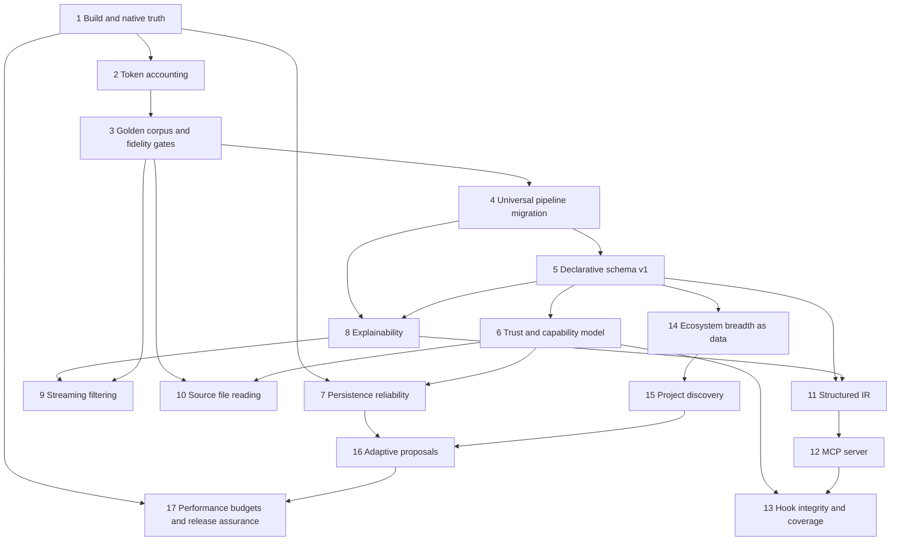

# Condense — Project Handoff

**Audience:** the next coding agent (or engineer) taking over this repository.
**Written:** 4 September 2026. **Revised:** 4 September 2026 (Phase 7 code landed).
**Upstream:** https://github.com/AryanKatwal06/condense
**Local workspace:** `c:\Users\katwa\OneDrive\Desktop\code-condenser`
**Branch at handoff:** `main` after Phase 7. Confirm with `git log -1` and origin before starting Phase 8.

> **Authority rule.** Where this document and the live repository disagree, **the repository wins** — then correct this file. Every factual claim below was verified against source on the revision date; §12 records how.

---

## Table of contents

1. What this project is
2. Non-negotiable constraints
3. Repository layout
4. Verified current architecture
5. Verified defect and gap inventory
6. Documentation inaccuracies (docs lie; code is right)
7. Completed work (pre-roadmap product history)
8. This engagement: what was actually done
9. The 17-phase roadmap — all phases, statuses preserved
10. Parity vs deliberate superiority vs net-new
11. Zap reference appendix (benchmark only)
12. Verification log
13. Exact stop point
14. NEXT AGENT INSTRUCTIONS

---

## 1. What this project is

Condense is a **Java / Quarkus / GraalVM native-image CLI** that sits between an AI coding agent and the shell. It executes the real command, captures the output, applies command-specific compression, and hands the agent a dense summary instead of thousands of raw lines (progress bars, passing tests, ANSI escapes, redundant paths). Savings are recorded to a local SQLite database and surfaced via `condense gain`.

**Zap is a benchmark, not a blueprint.** Zap (`https://github.com/bitan-del/zap`, Rust, Apache-2.0, ~275 stars) is studied **only** as a capability and product-quality reference. Condense keeps its own architecture, naming, CLI conventions, tests, and security model. Where Zap solves a problem well, understand the underlying engineering problem and solve it in a Java-idiomatic, native-image-safe way. Where Zap is weak or buggy, do not reproduce the weakness — §11 lists the specific ones.

**Success metric (from the original commissioning brief):** a professional engineer with access to both codebases should conclude Condense is the stronger, more reliable, more securely engineered, more maintainable product — **even if Condense's command surface stays smaller for a long time**. Depth, correctness, and verified reliability outrank feature-count parity.

**Version:** `1.0.1` in `condense/pom.xml`.
**Compiler release:** `21` (Phase 1).
**CI toolchain:** GraalVM Community **21** (JVM tests and all native builds).

---

## 2. Non-negotiable constraints

These came from the commissioning brief and from the user directly. Do not silently drop any of them.

### Engineering constraints

1. **Must remain a working Java 21+ GraalVM native-image application at every stage.** Never propose unrestricted runtime reflection, dynamic class loading by a runtime-supplied name, or unbounded classpath scanning without naming the native-image risk *and* a concrete native-safe alternative in the same breath.
2. **Never introduce Zap source code, Rust file structure, or Rust-derived naming** into Condense.
3. **JVM-mode success is never proof.** Every phase needs independently verifiable native-image evidence. Historical justification: making sqlite-jdbc work in the native image took **four distinct attempts** (build-time init directives → forced driver registration → bundling native libs → *finally* bypassing `java.sql.DriverManager` and connecting through the driver instance, because `DriverManager`'s classloader-identity check silently rejects a correctly registered driver **only** inside the native image).
4. **No new external dependency without stated justification**, covering native-image compatibility, startup cost, and cross-platform portability.
5. **Fail-open is the house philosophy.** A filter, analytics, override, or hook failure must degrade gracefully — never crash the proxied command, never alter its exit code.
6. **`SafePathValidator` is the trusted template for filesystem work** (canonicalize with `toRealPath()`, contain with `Path.startsWith()` on canonical paths, per-entry symlink checks, refuse to delete directories containing unrecognized content). Extend and reuse it; do not reinvent path safety per subsystem.
7. **Every phase needs objective, third-party-verifiable exit criteria.** "Filtering is improved" and "the system is more robust" are explicitly unacceptable.

### Process constraints (user-enforced, applies to the whole remaining project)

8. **Plan-then-approve, every phase, no exceptions.** Before writing, generating, modifying, or applying *any* code, config, or file change for a phase, present the complete implementation plan **and stop**. Silence, a question, or a request to change the plan all mean **not approved** — revise and keep waiting. Only an explicit **"proceed" / "go ahead" / "start"** authorizes implementation. This governs Phase 2 through Phase 17 exactly as it governed Phase 1.
9. **Each phase plan must contain, at minimum:** exact scope; exact files expected to be created/modified (with an explicit note that they will be re-verified against the live repo first); architectural approach and reasoning; what is explicitly out of scope so later phases do not leak in; test and verification strategy **including native-image verification**; concrete done criteria.
10. **Git conventions once implementation starts:** commit in small finished slices; **push after every couple of changes that feel final**; **no colons (`:`) anywhere in commit messages**; write humanized messages (the existing history is the style guide — e.g. `Add regex execution time bounding and static complexity budgets to prevent regular expression denial of service`). Never force-push `main`. Never commit credentials.

---

## 3. Repository layout

Root is a wrapper; the Maven project lives in `condense/`.

```
code-condenser/
├─ .github/
│  ├─ workflows/{build.yml, release.yml, phase3-verification.yml}
│  ├─ ISSUE_TEMPLATE/{bug_report.yml, feature_request.yml}
│  └─ dependabot.yml
├─ condense/                      ← Maven module (groupId com.condense, artifactId condense, 1.0.1)
│  ├─ pom.xml
│  ├─ ARCHITECTURE.md, README.md (pointer to root README)
│  ├─ install.sh, install.ps1, uninstall.sh
│  ├─ packaging/{completions,deb,homebrew,man,rpm,scoop,winget}
│  └─ src/{main,test}/...
├─ docs/{HOOKS.md, token-estimator.md, fidelity-corpus.md, perf-baseline.md, social-preview.svg}
├─ README.md, CHANGELOG.md, CONTRIBUTING.md, SECURITY.md, LICENSE, NOTICE
└─ PROJECT_HANDOFF.md             ← this file
```

**Untracked local noise present in the workspace** (gitignored, safe to ignore, do not commit): `apache-maven-3.9.6/`, `maven.zip`, `temp-release/`, `temp-release-rc2/`, `.worktrees/`, `gh_logs.txt`, `linux_job_log.txt`, `.vscode/`.

**`.cursor/` is untracked and NOT in `.gitignore`.** The roadmap plan file at `.cursor/plans/condense_master_roadmap_19b36738.plan.md` is therefore **local-only** — it is not in the GitHub repository and a fresh clone will not have it. **This handoff is the durable, in-repo record of the roadmap.** Treat §9 as the source of truth.

### `.gitignore` hazards for future phases

These patterns will **silently swallow** files a later phase might legitimately want to commit. Check before creating such a file:

| Pattern | Risk |
|---|---|
| `*.py` | A Phase 2 token-calibration script or corpus generator written in Python would be ignored |
| `Test*.java` | A helper named `TestSupport.java` would be ignored (`*Test.java` is fine — that is the existing convention) |
| `implementation_plan.md`, `task.md`, `walkthrough.md`, `temp_*.md` | Phase planning docs under those names will not commit |
| `*.db`, `*.db-wal`, `*.db-shm` | A checked-in golden SQLite fixture for Phase 7 would be ignored |
| `*.exe`, `*.so`, `*.dylib`, `*.dll` | Expected; native artifacts stay out |

---

## 4. Verified current architecture

### 4.1 Runtime flow

```
CLI args
  → CondenseMain                (Quarkus QuarkusApplication + picocli IFactory)
    → CondenseRootCommand.call()
      → CommandExecutor.execute()      capture-then-filter — NOT streaming
      → StrategyRegistry.lookup()      CDI beans + @CommandFilter, longest-prefix match
      → FilterStrategy.apply()         runs only after the child process exits
      → TeeWriter.maybeDump()          raw output spill per TeeMode
      → print filtered output
      → TrackingRepository.insert()    synchronous, fail-open, after stdout flush
      → return the child's exit code
```

`CondenseMain` sets `setUnmatchedArgumentsAllowed(true)` and `setStopAtPositional(true)` so any unrecognized argv is treated as a command to proxy. A `Callable<Integer>` result from the root command overrides picocli's own exit code. A `ShutdownEvent` observer force-destroys child processes and descendants.

### 4.2 Command capture (`core/CommandExecutor.java`)

| Property | Value |
|---|---|
| Model | Two daemon threads drain stdout and stderr concurrently |
| Sink | Temp files, `condense-stream-*.log` |
| Chunk size | 8192 bytes |
| Hard cap | 10 MB **per stream**, then `OutputLimitExceededException` |
| Streams | Separate (`redirectErrorStream(false)`) |
| Default timeout | 60 s, then `destroyForcibly()` and exit code `-1` |
| Self-proxy guard | Refuses to exec `condense` / `condense-runner` as a child |

**This is not a memory-safety problem** — output never accumulates on the JVM heap unbounded. The real gap is that **filtering begins only after the process fully exits**, so a long `npm install` or `docker build` shows the agent nothing until it finishes. That is Phase 9.

### 4.3 Filter dispatch (`core/StrategyRegistry.java`)

`@PostConstruct` walks CDI `Instance<FilterStrategy>` handles, reads `@CommandFilter` via `getAnnotationsByType(...)` (**runtime annotation reflection** — hence the `reflect-config.json` entries for the annotations), lowercases keys into a `LinkedHashMap`, and skips `PassthroughStrategy`. Lookup joins argv from longest prefix down to length 1, so `git status --short` resolves `git status` before `git`.

**Duplicate prefixes fail fast.** `PrefixIndex.put` throws `IllegalStateException` at `@PostConstruct` if two different classes claim the same key. Same class, many prefixes is allowed.

### 4.4 Token accounting (`core/TokenCounter.java`)

```java
public static int count(String text) { return Utf8WeightedTokenEstimator.INSTANCE.count(text); }
```

`utf8_weighted_v1` walks Unicode code points. CJK / Hangul / kana / emoji are dense (1 token each); Latin runs use ceiling division by 4. `count(Path)` decodes the file as UTF-8 with replacement and uses the same function — never `Files.size()`. Published p95 relative error vs cl100k_base is **0.35**. `gain` JSON includes an `estimator` object; text output labels counts as estimates. See `docs/token-estimator.md`.

### 4.5 CLI surface

Registered subcommands: `gain`, `doctor`, `init`, `config` (with nested `validate` and `trust`), `completion`, `update`, `mcp`, `uninstall`. Default (no subcommand) = proxy mode.

Root options: `-v`/`--verbose` (repeatable, 0–3), `-u`/`--ultra-compact`, plus standard help/version.

`mcp` is a **stub** — `--start` prints an error and returns 1; the bare command prints a "planned" notice and a sample client config. Phase 12.

### 4.6 Filters — exact counts (verified)

- **32 domain filter classes**, plus `PassthroughStrategy` = **33 classes implementing `FilterStrategy`**.
- Package breakdown: `git` 6, `node` 5, `cloud` 5, `python` 4, `fs` 4, `cargo` 3, `build` 3, `golang` 2. (6+5+5+4+4+3+3+2 = 32.)
- **~47 registered command prefixes** across those 32 classes (several filters claim multiple prefixes, e.g. `CargoInstallFilter` → `cargo install` + `cargo build`; `GrepFilter` → `grep` + `rg`; `CatFilter` → `cat` + `read`).
- **All 31 compressing domain filters extend `PipelineBackedFilter`.** `PythonFilter` is the documented router (`python -m pytest` → `PytestFilter`; `python -c` stays identity). `PassthroughStrategy` remains the unmatched-command fallback and does not extend the adapter.
- **`apply()` is final on the adapter.** Gates live in `beforePipeline`; parsing lives in named `FilterStage`s. No-arg constructors used by the corpus share `FilterOverrideLoader.standalone()`.
- **Shared stages:** the original six (`AnsiStrip`, `Deduplication`, `Grouping`, `JsonStructure`, `StateMachine`, `TreeCompression`) plus `TailLinesStage`, `HeadTailStage`, `AggregateByKeyStage`, `RegexCaptureStage`, `GitStatusStage`, `JsonLinesStage`, `DockerPsStage`. Supporting: `BoundedRegex`, `TimeoutCharSequence`, `RegexTimeoutException`.

### 4.7 Pipeline (`filter/pipeline/`)

`FilterStage` is a `@FunctionalInterface`: `StageResult process(String input, FilterContext context)`. Stages are contractually **stateless and thread-safe**.

`FilterPipeline.execute` iterates an immutable stage list; per stage it `try/catch (Exception)`, logs `warnf` with the class name, and **continues from the last good output** (fail-open). A `null` `StageResult` is skipped. `StageResult.stopWith(...)` short-circuits. Null input normalizes to `""`.

`FilterContext` is a record of `(command, result, config, verbose, ultraCompact)` with null-normalizing factories.

### 4.8 Declarative overrides (`filter/pipeline/config/`)

Three-tier precedence, first match wins:

1. `{projectDir}/.condense/filters.toml`
2. `{PlatformDirs.resolveConfigDir()}/filters.toml`
3. the compiled Java `defaultPipeline` supplied by the calling filter

Parsing is Jackson `TomlMapper` into `@RegisterForReflection` records. Command lookup is exact key → case-normalized → prefix match.

**Security posture as implemented:**

| Control | Detail |
|---|---|
| Strategy dispatch | Hardcoded `switch` on lowercased alias strings. **No reflection, no dynamic class loading** — a hostile file structurally cannot name a Java class to execute |
| Path safety | `SafePathValidator.contain(file, expectedParent)` (`toRealPath` + `startsWith` + `NOFOLLOW_LINKS`) |
| ReDoS | Override-supplied regexes get a **200 ms** in-thread budget via `TimeoutCharSequence` (deadline checked every 256 `charAt` calls, no threads — native-image friendly) |
| Static budgets | Pattern length ≤ 500; state-machine transitions ≤ 50; dedup window 1–10000; grouping pattern must have ≥1 capture group |
| Failure mode | Fail-open at every tier: bad file → warn → fall through to the next tier |

**Cache:** `ConcurrentHashMap<Path, CachedOverride>` for project configs, `volatile` + double-checked lock for the global config, and a per-`CachedOverride` pipeline map. **Negative results are cached**, so a `filters.toml` created after first lookup is invisible until `invalidateCache()`. No file-watch.

**Trust.** Project `.condense/filters.toml` goes through `TrustGate` after a valid parse. Untrusted, hash-changed, or under-granted files are skipped (stderr hint; child's exit code unchanged). User-global and builtin files are not TOFU'd. Review is `condense config trust`. See [docs/trust.md](docs/trust.md).

Production filters inject the `@ApplicationScoped` `FilterOverrideLoader`. Corpus / `new XxxFilter()` share `FilterOverrideLoader.standalone()`.

### 4.9 Persistence (`core/TrackingRepository.java`)

Single table:

```sql
CREATE TABLE IF NOT EXISTS commands (
  id INTEGER PRIMARY KEY AUTOINCREMENT,
  ts INTEGER NOT NULL,           -- unix epoch seconds
  command TEXT NOT NULL,
  project TEXT,                  -- 12-char hex fingerprint
  cwd TEXT,
  raw_tokens INTEGER NOT NULL,
  out_tokens INTEGER NOT NULL,
  exec_ms INTEGER NOT NULL
);
-- idx_commands_ts, idx_commands_project
```

Connection — **this is the load-bearing native-image fix, do not "clean it up":**

```java
java.sql.Driver driver = new org.sqlite.JDBC();
connection = driver.connect(url, new java.util.Properties());
```

Every open applies `PRAGMA busy_timeout=5000`, `PRAGMA journal_mode=WAL` (fail-open), then `SchemaMigrator` (`PRAGMA user_version`, target **1**). Version 1 keeps `commands` unchanged and adds `filter_outcomes` for fail-open incidents. Newer-than-us schemas skip migrations. Retention is 90 days for both tables and a bounded tee sweep (256 unlinks, no symlink follow). Writes stay synchronous and fail-open. Spec: [docs/persistence.md](docs/persistence.md).

`gain` (`analytics/`) supports the default summary, `--graph`, `--history [N]`, `--daily`, `--weekly`, `--top N`, `--format json`, `--since DAYS` (default 30), `--all`, and project-vs-global scope. Degraded persistence prints `⚠ analytics unavailable — persistence failed, see logs` to stderr. An empty healthy store prints `No tracking data yet. Run condense doctor to see why.` `condense doctor` (text / `--format json`) names `empty_tracking_reason`.

### 4.10 Platform directories (`core/PlatformDirs.java`)

| OS | Config | Data |
|---|---|---|
| Linux | `$XDG_CONFIG_HOME/condense` else `~/.config/condense` | `$XDG_DATA_HOME/condense` else `~/.local/share/condense` |
| macOS | `~/Library/Application Support/condense` | same as config |
| Windows | `%APPDATA%\condense` | same as config |

**No Condense-owned override exists.** Consequence: the native integration test writes to the developer's **real** analytics DB. Linux can be isolated via `XDG_*` and Windows via `APPDATA`, but **macOS is hardcoded** and cannot be redirected. Phase 1 adds `CONDENSE_CONFIG_DIR` / `CONDENSE_DATA_DIR`.

### 4.11 Path safety (`core/SafePathValidator.java`)

Allowed roots are the resolved config and data dirs. Files are checked for nominal containment, then existence, then `toRealPath()` symlink-escape. Directory purge allows known files plus the `tee/` directory when it contains only regular files:

```java
KNOWN_CONDENSE_FILES = Set.of("condense.db", "condense.db-wal", "condense.db-shm",
    "config.toml", "trust.json", "filters.toml", ".install_dir", ".condense_install_dir");
KNOWN_CONDENSE_DIRECTORIES = Set.of("tee");
```

`uninstall --purge` recurses into known directories. Unknown files or nested dirs still abort with `UNEXPECTED_CONTENTS`.

### 4.12 Hooks (`hooks/`)

`HookTool` constants: `GENERIC_BASH`, `CLAUDE_CODE`, `CURSOR`, `GEMINI`, `WINDSURF`, `COPILOT`, `CLINE` (7). Templates under `src/main/resources/hooks/` include shell and PowerShell variants for Copilot and Windsurf. Idempotency is a sentinel string, `# Installed by: condense init`; removal only deletes files carrying it.

**Absent:** any checksum, integrity, tamper, ownership, or permission verification of installed hooks, and **any backup of a third-party config file before merging into it** (Claude/Cursor/Gemini/Windsurf/Copilot JSON is edited in place). Phase 13.

### 4.13 Native image configuration

| File | Contents |
|---|---|
| `native-image.properties` | `--no-fallback`, `-H:+ReportExceptionStackTraces`, build-time init for slf4j/jboss-logging, run-time init for `org.sqlite.{JDBC, core.NativeDB, core.DB}` |
| `jni-config.json` | `org.sqlite.core.NativeDB` methods (`_open_utf8`, `close`, `interrupt`, `busy_timeout`, `exec_utf8`, `changes`, `total_changes`) |
| `resource-config.json` | `com/condense/version.properties`, `filters/.*\.toml`, `hooks/.*`, `application.properties`, `org/sqlite/native/.*` |
| `reflect-config.json` | Hand-maintained. **6 classes are registered twice**: `GainReport` and all five `TrackingRepository` nested records (`AggregateStats`, `DailyStat`, `WeeklyStat`, `TopCommand`, `RecentCommand`) |

`resource-config.json` includes `filters/.*\.toml`. Phase 5 ships `filters/index.toml` plus 31 definition files (no `python.toml`). Enumeration is the index; runtime never walks the directory. POM native args add `--initialize-at-build-time=com.condense` plus a per-OS `sqlite.native.exclude` regex that strips non-matching SQLite native libraries.

### 4.14 Build and CI

`condense/pom.xml`: Java **17** release, Quarkus **3.11.0** BOM, `finalName` `condense`, `skipITs` default **true**.

Runtime dependencies (deliberately few): `quarkus-picocli`, `quarkus-arc`, `jackson-databind`, `org.xerial:sqlite-jdbc:3.45.3.0`, `jackson-dataformat-toml:2.17.1`. Test: `quarkus-junit5`, `assertj-core:3.26.0`. Provided: `picocli-codegen:4.7.6` (also an annotation processor).

Profiles: six auto-activating `os-*` profiles setting `sqlite.native.exclude`; `native`, `native-static` (musl, `--static`), `native-debug`.

Surefire explicitly excludes `**/*IT.java` (documented rationale: prevent ITs from running without the native binary properties). Failsafe runs `integration-test` + `verify` and passes `native.image.path=${project.build.directory}/${project.build.finalName}-runner`.

| Workflow | Trigger | Jobs |
|---|---|---|
| `build.yml` | push to any branch, PR to main | `jvm-test` (ubuntu, GraalVM 21, `mvn verify`) → `native-builds` matrix: ubuntu-latest, windows-latest, macos-15 |
| `release.yml` | tag `v*` | create-release → build-native (linux-x64, macos-aarch64, windows-x64) → build-deb → publish (checksums, cosign, CycloneDX SBOM) |
| `phase3-verification.yml` | `workflow_dispatch` only | Linux x64 only: 300-run soak, permission-denial fail-open, 5-way concurrency + `PRAGMA integrity_check` |

`native-builds` verifies no `fallback` in `target/native.log`, then runs duplicated bash/pwsh smoke tests: version/help, exit-code passthrough, `git status`, `gain --format json` with `total_commands >= 1`, non-interactive `--purge` refusal, fake-Homebrew/fake-Scoop package-manager detection with no self-delete, and end-to-end purge with self-deletion of a disposable copy. It also records binary size and 5× cold-start, and pushes metrics to a `ci-metrics` branch.

**Critically: native jobs run `mvn package -Pnative -DskipTests`, so Failsafe never executes.** The one native Java IT that exists is dead weight in CI.

---

## 5. Verified defect and gap inventory

Ordered by the phase that owns each item. **Do not opportunistically fix items outside the phase you are authorized to implement** — that is exactly the scope creep the plan-then-approve protocol exists to prevent.

| # | Item | Evidence | Owner |
|---|---|---|---|
| D1 | ~~`java.version` is `17` while docs/CI say 21~~ **FIXED** | POM `java.version` 21; bytecode major 65 | Phase 1 |
| D2 | ~~Native Failsafe ITs never run in CI~~ **FIXED** | Failsafe after native package on four OS jobs | Phase 1 |
| D3 | ~~Native IT mutates real `condense.db`; macOS cannot be redirected~~ **FIXED** | `CONDENSE_CONFIG_DIR` / `CONDENSE_DATA_DIR` | Phase 1 |
| D4 | ~~Duplicate reflect-config entries; no drift test~~ **FIXED** | `ReflectConfigDriftTest` | Phase 1 |
| D5 | ~~No linux-aarch64 CI or release job~~ **FIXED** | `ubuntu-24.04-arm` in build.yml and release.yml | Phase 1 |
| D6 | ~~`install.sh` header advertises Intel macOS prebuilts~~ **FIXED** | Header matches shipped platforms | Phase 1 |
| D7 | ~~Token counting is a `/4` heuristic mixing bytes and chars~~ **FIXED** | `utf8_weighted_v1`; file and string share one UTF-8 code-point function; published p95 0.35 vs cl100k_base | Phase 2 |
| D8 | ~~No machine-enforced savings or fidelity gate; the "≥60% savings" bar is prose only~~ **FIXED** | `corpus/catalog.json` + `FidelityCorpusTest`; 100% critical-signal retention; baked floors | Phase 3 |
| D9 | ~~29 domain filters are not on `FilterPipeline`~~ **FIXED** | 31 extend `PipelineBackedFilter`; `PythonFilter` routes | Phase 4 |
| D10 | ~~`StrategyRegistry` silently last-wins on duplicate command prefixes~~ **FIXED** | `PrefixIndex` throws at `@PostConstruct` | Phase 4 |
| D11 | ~~Built-in `ESLintFilter` constructs `GroupingStrategy` with `timeoutMillis = 0`~~ **FIXED** | `GroupingStrategy` / `BoundedRegex` default 200 ms | Phase 4 |
| D12 | ~~Migrated filters `new FilterOverrideLoader()` in constructors~~ **FIXED** | CDI inject + `standalone()` singleton | Phase 4 |
| D13 | ~~No built-in declarative filter definitions~~ **FIXED** | `filters/index.toml` + 31 definition files; `PipelineBackedFilter.buildPipeline()` loads the catalog | Phase 5 |
| D14 | ~~No trust gate on project-supplied `.condense/filters.toml`~~ **FIXED** | `TrustGate` + `{configDir}/trust.json`; skip until TOFU or CI hatch | Phase 6 |
| D15 | ~~No output provenance~~ **FIXED** | `FilterResult.of` stamps `condense[filtered]`; impersonators become `condense[quoted]` | Phase 6 |
| D16 | ~~No schema versioning or migrations~~ **FIXED** | `PRAGMA user_version` target 1; `SchemaMigrator` | Phase 7 |
| D17 | ~~No WAL, no `busy_timeout`~~ **FIXED** | applied on every open | Phase 7 |
| D18 | ~~No retention~~ **FIXED** | 90-day DELETE + bounded tee sweep | Phase 7 |
| D19 | ~~Filter failures logged only~~ **FIXED** | `filter_outcomes` for stage/apply fallbacks | Phase 7 |
| D20 | ~~`--purge` aborts on `tee/` and `filters.toml`~~ **FIXED** | allowlist + known-dir recursion | Phase 7 |
| D21 | `gain --top N` is ignored when `N == 10` because the branch is `if (top != 10)` and the default is `10` | `GainCommand:123` | Phase 8 (or a dedicated fix) |
| D22 | No explainability — nothing shows which stage dropped which lines | by inspection | Phase 8 |
| D23 | Filtering is capture-only; nothing is emitted until the child exits | `CondenseRootCommand.call()` ordering | Phase 9 |
| D24 | No token-optimized source-file reading capability at all | no such command | Phase 10 |
| D25 | No structured output IR; each filter emits ad-hoc text | by inspection | Phase 11 |
| D26 | `condense mcp` is a stub | `commands/McpCommand.java` | Phase 12 |
| D27 | No hook integrity/tamper verification, and **no backup before editing third-party configs** | `hooks/HookInstaller.java` | Phase 13 |
| D28 | Agent coverage is a strict subset of Zap's, plus a generic-bash fallback | `hooks/HookTool.java` | Phase 13 |
| D29 | Benchmarks print numbers but assert nothing; no enforced performance budget | `FilterPipelineBenchmarkTest`, `FilterOverrideBenchmarkTest` | Phase 1 baseline, Phase 17 gate |

### Known test-coverage gaps (from the filter-subsystem audit)

Concurrent `FilterOverrideLoader` access; global-tier override precedence end-to-end; `json_structure` override parsing; prefix command matching for overrides (`npm install --verbose` → `npm install`); empty override stage list replacing a default pipeline; direct unit tests for `TimeoutCharSequence` / `RegexTimeoutException`; automatic cache invalidation on file change; the unbounded built-in ESLint regex; `FilterOverrideValidationResult` standalone; the public `validateGlobalOverrides()` / `validateProjectOverrides()` API.

---

## 6. Documentation inaccuracies (docs lie; code is right)

The next agent will be misled by these if they trust the docs. They are **documentation defects, not code defects**. Fix them opportunistically when the owning phase touches the file, and never treat them as behavioral specifications.

| Location | Claim | Reality |
|---|---|---|
| `condense/ARCHITECTURE.md` "Technology Stack" | "**Java 21** — language level" | POM compiles with `--release 17` |
| `README.md:290` | "Prerequisites: Java 17+" | CI and CONTRIBUTING require GraalVM JDK 21 |
| `README.md:164-165, 239` | Config example shows `[general] ultra_compact = true` | `CondenseConfig` has **no `[general]` section**; ultra-compact is CLI-only via `-u` |
| `CHANGELOG.md:39` | "**42 command filters**" | 32 domain filter classes exist |
| `CHANGELOG.md:42` | "**12 filter strategies**" including "NDJSON streaming" | 6 strategy classes exist; there is no NDJSON streaming strategy |
| `CONTRIBUTING.md:51-57` | Sample filter uses `FilterResult.passthrough(result.combined())`, `FilterResult.of(raw, filtered)`, `result.stdout()` | Real signatures are `passthrough(ExecutionResult)`, `of(ExecutionResult, String)`, `readStdout()`. **The documented example does not compile** |
| `CONTRIBUTING.md:127` | "The PR template will ask you to confirm…" | No `.github/PULL_REQUEST_TEMPLATE` exists |
| `CONTRIBUTING.md:111-117` | "Add to reflect-config.json" as a manual step | Phase 1 replaces this ritual with a drift test; update the doc then |
| `condense/ARCHITECTURE.md` file table | Lists only the bootstrap/config/analytics classes | Says nothing about the 32 filters, pipeline, or overrides — materially incomplete |
| Root `README.md` supported-commands table | 30 rows | Code registers ~47 prefixes; undocumented ones include `read`, `docker run`, `docker exec`, `python -c`, `ruff`, `npx eslint`, `npm ci`, `npm i`, `pip3 install`, `./mvnw`, `./gradlew` |

---

## 7. Completed work (pre-roadmap product history)

This is **shipped product history that predates the 17-phase roadmap**. It is genuinely done. Preserve it so nobody re-does it. Source: `CHANGELOG.md` plus `git log`.

### 7.1 `1.0.0-rc1` — 2026-06-30 — **COMPLETED**

Initial Java/GraalVM product: the filter suite, `condense gain` analytics (chart, history, top-N, daily/weekly, project scope, JSON), `condense init` hook installer, `condense config`, native image with sub-100 ms cold start, SQLite analytics, the tee system, ultra-compact and verbose modes, shell completions, a man page, musl static Linux builds. (Note the inflated filter/strategy counts in that entry — see §6.)

### 7.2 `1.0.0` — 2026-08-24 — **COMPLETED**

- **BUG-002** — SQLite persistence inside the native image. Four attempts; the fix that worked was bypassing `DriverManager` entirely. **This is the origin of constraint #3.**
- **BUG-003** — `gain` now prints a degraded-analytics warning instead of a misleading zero dashboard.
- **BUG-001** — repository rename cleanup (`code-condenser` → `condense`) across docs, installers, packaging, self-update endpoints.
- **BUG-004 / BUG-005** — diagnostic logging added to previously silent catch blocks in filtering and hook install/removal.
- **NEW-006/007** — CI and release workflows structurally assert `gain --format json` across all three OSes.
- **NEW-008** — strict errorlevel checking after `vcvarsall.bat` on Windows.
- **NEW-009** — macOS artifact renamed to `condense-macos-aarch64`; installer guidance for Intel users.
- `UpdateCommand` hardened with SHA-256 verification, HTTP error handling, Content-Type validation.
- `TrackingRepositoryNativeIT` written; `phase3-verification.yml` added; Sigstore/cosign signing and CycloneDX SBOM wired into release.
- Apache-2.0 LICENSE and NOTICE added; `macos-latest` pinned to `macos-15`.

### 7.3 Unreleased on `main` (through `fe4ad98`) — **COMPLETED**

Three sequential efforts the 17-phase roadmap builds directly on top of. Commit trail, oldest first:

| Commit | Work |
|---|---|
| `a462e3f` … `13188a7` | `SafePathValidator`, `PackageManagerDetector`, `PlatformDirs.resolveConfigDir/resolveDataDir`, `UninstallCommand` with allowlist safety, install-dir metadata, native uninstall smoke tests on all three OSes, exit-code semantics on partial failure |
| `39ab681`, `be37c05`, `6506d6f`, `3a81d8c`, `86ab791`, `f9b2454`, `02de628` | `FilterPipeline`/`FilterStage` abstraction; 3 filters migrated; fail-open stage hardening; **benchmark methodology corrected** (interleaved execution, discarded warmup, mean ± stddev — an earlier version had produced flattering numbers purely from measurement-order bias, caught by independent scrutiny); concurrency and stage-reuse tests; Surefire IT exclusion with documented rationale |
| `5817e3f`, `4e4d8ed`, `214cb33`, `e59b6ad`, `fe4ad98` | Declarative override loader + `config validate`; **ReDoS bounding added after an independent security audit found unbounded user regexes**; **in-memory override caching added after an audit found uncached filesystem I/O and redundant parsing on every filter invocation**; adversarial security test suite (11 named attacks) |

**Key files:** `condense/src/main/java/com/condense/filter/pipeline/**`, `filter/strategy/**`, `filter/pipeline/config/**`, `core/SafePathValidator.java`, `uninstall/`, and tests under `src/test/java/com/condense/filter/pipeline/**`.

**Caveat carried from the commissioning brief:** the override system's final closeout had not received a third independent confirmation pass. Re-verify it before treating it as immovable — but **do not reopen it during Phase 1**.

---

## 8. This engagement: what was actually done

Two turns of planning, then Phase 1 through Phase 5 code.

| Activity | Status | Notes |
|---|---|---|
| Independent deep study of Condense | **COMPLETED** | Three parallel read-only audits: core/dispatch, filters/pipeline, analytics/hooks/CI/packaging |
| Independent deep study of Zap | **COMPLETED** | Full file tree + direct reads of `core/toml_filter.rs`, `core/tracking.rs`, `core/stream.rs`, `hooks/trust.rs`, `cmds/system/read.rs`, `main.rs`, `parser/types.rs`, a sample filter TOML, plus a delegated audit of hook security, discovery/learning, runner/telemetry, build/packaging, CI absence, and the issue tracker |
| Correction of the commissioning brief | **COMPLETED** | Seven material corrections; see §11.3 |
| 17-phase roadmap | **COMPLETED as titles + intent** | Written into the Cursor plan file. That file's YAML holds all 17 titles; its body was a placeholder and now points here |
| Phase 1 implementation plan | **COMPLETED** | Revised 4 Sep 2026, then authorized with "proceed" |
| Phase 1 code | **LANDED** | Java 21, env overrides, drift test, Failsafe native ITs, linux-aarch64 matrix, 80 MiB size ceiling. Native proof is CI run 33860368090. |
| Phase 2 implementation plan | **COMPLETED** | Presented 4 Sep 2026, then authorized with "start executing" |
| Phase 2 code | **LANDED** | `utf8_weighted_v1`, UTF-8 file/string agreement, published p95 0.35 vs cl100k_base, `gain` estimator metadata. Native proof is the next green `NativeAnalyticsIT` run. |
| Phase 3 implementation plan | **COMPLETED** | Presented 4 Sep 2026, then authorized with "start executing" |
| Phase 3 code | **LANDED** | Versioned catalog (51 entries, 32/32 domain filters), 100% critical-signal retention, baked savings floors, seeded fuzz, `NativeCorpusIT`. Native proof is the next green `NativeCorpusIT` run. |
| Phase 4 implementation plan | **COMPLETED** | Presented 4 Sep 2026, then authorized with "EXECUTE" / "start executing" |
| Phase 4 code | **LANDED** | Universal `PipelineBackedFilter`; 51-row golden lock; `PrefixIndex`; `BoundedRegex` 200 ms (5 s document budget for ANSI/dedup); CDI + `standalone()` loader. Native proof is `NativeCorpusIT` through pipeline-backed `pytest`. |
| Phase 5 implementation plan | **COMPLETED** | Presented 4 Sep 2026, then authorized with "Implement the plan" |
| Phase 5 code | **LANDED** | Schema v1 TOML builtins; `StageFactory`; `definitionName()`; `process-classes` validator; `NativeBuiltinDefinitionIT`. Native proof is CI `NativeBuiltinDefinitionIT` + `NativeCorpusIT`. |
| Phase 6 code | **LANDED** | `TrustGate` + `{configDir}/trust.json`; capability grants; `condense[filtered]` provenance; `NativeTrustIT`. |
| Phase 7 implementation plan | **COMPLETED** | Presented 4 Sep 2026, then authorized |
| Phase 7 code | **LANDED** | `user_version` 1, WAL, `busy_timeout`, 90-day retention, `filter_outcomes`, `condense doctor`, D20 purge allowlist. Native proof is the next green `NativePersistenceIT`. |
| Phases 8–17 code | **NOT STARTED** | Each needs its own plan-then-approve cycle |
| This handoff | **COMPLETED** | Written, audited, then updated as phases landed |

**Roadmap file:** `.cursor/plans/condense_master_roadmap_19b36738.plan.md` — YAML frontmatter with `p1`…`p17`; `p1`–`p7` are marked `completed`, `p8`–`p17` `pending`. **That file is untracked and local-only (see §3).**

---

## 9. The 17-phase roadmap — all phases, statuses preserved

**Phase 1 through Phase 7 code have landed.** Phases 8–17 have not been implemented. Each remaining phase still needs its own plan-then-approve cycle.

The phase count was derived from real architectural dependencies, not padded or compressed. **Do not renumber, merge, split, or reorder phases** without an explicit decision from the user.

### Dependency chain



Reading of the chain: **trust the binary and the measurements (1) → trust the savings numbers (2) → make fidelity machine-checkable (3) → one execution engine for every filter (4) → filters become data (5) → trust that data (6) → persistence you can believe (7) → make it explainable (8) → stream it (9) → read files too (10) → structure the output (11) → serve it natively to agents (12) → harden the hooks (13) → then buy breadth cheaply (14) → detect context (15) → propose improvements safely (16) → enforce budgets at release (17).**

---

### Phase 1 — Build and native-image truth baseline

**Status: CODE LANDED 4 Sep 2026.** Native-image proof is the next green `build.yml` run on linux-x64, linux-aarch64, macos-aarch64, and windows-x64.

**Goal.** Make the compiler, CI, native tests, reflection registration, platform promises, and a measurement baseline all tell the same story.

**Why first.** Every later phase's evidence is worthless if `--release` is 17 while docs claim 21, native ITs never execute, reflection registration is a human checklist, and CI promises binaries it does not build. There is nothing in this roadmap Phase 1 depends on; it depends only on the existing native profiles and `TrackingRepositoryNativeIT`.

**Depends on.** Nothing in the roadmap.

**Architectural approach and reasoning.**

- *Env overrides live in `PlatformDirs`, not a test-only backdoor.* Native ITs invoke a compiled binary; Mockito and package-private setters cannot reach into it. Environment variables are the only control plane that behaves identically under JVM and native image. `PlatformDirs` is the single chokepoint every config/data consumer already routes through.
- *Drift test as a JVM gate, Failsafe as the native gate.* The four-attempt SQLite history is why both are needed. The drift test cheaply catches "forgot to register a class"; Failsafe catches "registered but still broken in the image", which is the actual BUG-002 failure mode.
- *No new libraries.* Drift test uses the JDK plus AssertJ (already a test dependency). The benchmark reuses the interleaved warmup / mean ± stddev method already proven in the pipeline tests. Native ITs use `ProcessBuilder`. Adding JMH or the Graal tracing agent would fight the project's dependency and native-image discipline.
- *linux-aarch64 belongs in PR CI, not only on tags.* `sqlite.native.exclude` is arch-specific; an x64-only matrix cannot see a broken aarch64 exclusion.
- *Uninstall smokes stay in the workflow.* They copy the binary, simulate Homebrew/Scoop layouts, and self-delete. Folding process suicide into JUnit alongside analytics assertions would be worse, not better.

**Scope — six deliverables, nothing more.**

1. Set `java.version` to **21** in `condense/pom.xml`; correct the README's "Java 17+". No Quarkus upgrade (3.11.0 already runs on 21).
2. Add `CONDENSE_CONFIG_DIR` and `CONDENSE_DATA_DIR` to `PlatformDirs`, highest precedence, ahead of the existing OS logic, `System.getenv` only.
3. Build a real native IT harness and **actually run it in CI**: a shared support class that locates the binary from `native.image.path`, fails hard when it is missing (never skips), and runs it with isolated config/data dirs. ITs cover `--version` / `--help`, exit-code passthrough, SQLite insert followed by `gain --format json` reporting `total_commands >= 1` (the BUG-002 regression, rewritten against a temp dir), and `config validate` against a missing override file. Wire `build.yml` to run Failsafe after the native package step on every matrix OS. Keep the destructive uninstall/purge smokes in the workflow.
4. Add a `ReflectConfigDriftTest` that parses `reflect-config.json` and fails when any `FilterStrategy` implementation, `@CommandFilter` / `@CommandFilters`, or Jackson-bound type (`CondenseConfig` + nested, `TeeMode`, `FilterOverrideConfig` + nested, `FilterOverrideValidationResult`, `GainReport`, `TrackingRepository` aggregate records) is unregistered, and fails on duplicate class names. Deduplicate the 6 existing duplicates to make it pass.
5. Generalize the benchmark method into an invocation-overhead baseline (empty/identity pipeline vs a trivial stage), printing mean ± stddev and asserting only a generous relative bound so wall-clock noise cannot flake CI. Record native cold-start and uncompressed binary size in CI in a structured form, and add a **size ceiling with real headroom** — measured from current CI artifacts first, not guessed.
6. Add **linux-aarch64** (`ubuntu-24.04-arm`) to both `build.yml` and `release.yml`. Do **not** add a macOS Intel job. Correct the `install.sh` header that still lists Intel macOS as a prebuilt.

**Files expected to be created** (re-verify against the live tree first; none existed at handoff):

- `condense/src/test/java/com/condense/nativeimage/NativeBinarySupport.java`
- `condense/src/test/java/com/condense/nativeimage/NativeCliIT.java`
- `condense/src/test/java/com/condense/nativeimage/NativeAnalyticsIT.java`
- `condense/src/test/java/com/condense/nativeimage/ReflectConfigDriftTest.java`
- `condense/src/test/java/com/condense/bench/InvocationOverheadBenchmarkTest.java`
- `docs/perf-baseline.md`

**Files expected to be modified:**

- `condense/pom.xml` — `java.version` → 21
- `condense/src/main/java/com/condense/core/PlatformDirs.java` — env overrides
- `condense/src/test/java/com/condense/core/PlatformDirsTest.java` — override coverage
- `condense/src/main/resources/META-INF/native-image/reflect-config.json` — remove duplicates only
- `condense/src/test/java/com/condense/core/TrackingRepositoryNativeIT.java` — delete or thin-wrap into the new harness (one IT touching SQLite, not two)
- `.github/workflows/build.yml` — aarch64 row; run Failsafe after native package; keep uninstall smokes
- `.github/workflows/release.yml` — linux-aarch64 target
- `condense/install.sh` — header accuracy
- `README.md` — Java 21; platform table matches what CI ships
- `CHANGELOG.md` — Unreleased entry
- `CONTRIBUTING.md` — drift test required; native ITs run via Failsafe
- `condense/ARCHITECTURE.md` — document the two env vars; fix the Java level

**Explicitly out of scope** (each belongs to a named later phase): token estimator work; golden corpus and savings gates; migrating the 29 remaining filters; declarative built-in TOML filters; the trust/capability model; SQLite `user_version`/WAL/retention/failure table; `condense explain`; streaming; file reading; MCP; hook changes; discovery; learning; Quarkus upgrade; **any** new Maven dependency; macOS Intel or Windows ARM CI; the `tee/` and `filters.toml` purge-allowlist bug (D20); `gain --top 10` (D21); the unbounded ESLint regex (D11); `new FilterOverrideLoader()` (D12); tightening benchmarks into hard CI time gates (D29 → Phase 17).

**Native-image verification for this phase specifically.** `--no-fallback` still fails the build on missing reachability. Failsafe ITs execute on Linux x64, Linux aarch64, macOS aarch64, and Windows x64 — not JVM only. Isolated dirs guarantee `gain` assertions cannot be polluted by a prior workflow step or a developer's real database. Binary size is ceiling-checked per OS job.

**Done criteria — objectively checkable by someone who did not implement it.**

1. `condense/pom.xml` declares Java **21**; `javap` on a built class reports major version **65**.
2. README, `install.sh` comments, ARCHITECTURE.md and CONTRIBUTING.md agree on Java 21 and on the shipped set: linux-x64, linux-aarch64, macos-aarch64, windows-x64, with Intel macOS documented as source-build only.
3. `ReflectConfigDriftTest` runs in the default `mvn test` suite; deleting one filter's `reflect-config.json` entry makes it fail; no duplicate entries remain.
4. `PlatformDirs` honors `CONDENSE_CONFIG_DIR` and `CONDENSE_DATA_DIR`, proven by unit tests; native ITs set both.
5. The BUG-002 assertion exists in a Failsafe IT and **its class name appears in `build.yml` native job logs** — not merely a shell `gain | grep`.
6. `build.yml` and `release.yml` both contain a linux-aarch64 native job, so `install.sh` downloading `linux-aarch64` is honest.
7. `docs/perf-baseline.md` exists; the JVM overhead benchmark runs under `mvn test`; native jobs publish size and cold-start; the size ceiling fails the job when exceeded.
8. The existing uninstall/purge smokes still pass on all three original OSes.
9. `pom.xml` gained **no** new runtime dependency; no filter, hook, or analytics schema changed.

**What later phases need from this one.** A build where the compiler level, CI, and docs agree; a reusable native IT harness every subsequent phase extends instead of hand-rolling more bash; a drift test that makes new reflective classes safe to add; hermetic config/data dirs (Phase 7's DB migration tests are impossible without them); and a measurement baseline Phase 17 converts into release gates.

---

### Phase 2 — Token accounting correctness

**Status: CODE LANDED 4 Sep 2026.** Native-image proof is the next green `NativeAnalyticsIT` in `build.yml` (estimator object in `gain --format json`).

**Goal.** Savings numbers a reviewer can defend. Replace the `/4` heuristic with a calibrated estimator, fix the bytes-vs-code-points confusion, document measured error bounds, and surface uncertainty in `gain`.

**Why here.** Phases 3 and 17 gate on savings percentages. Gating on a broken yardstick manufactures false confidence. It comes after Phase 1 because a calibration corpus and any estimator change must be verified in the native image, which requires Phase 1's harness.

**Depends on.** Phase 1.

**Introduces.** A `TokenEstimator` abstraction; a checked-in reference corpus with offline-computed reference counts; UTF-8-correct counting; confidence/error-bound reporting in `gain`.

**Deliberately different from Zap.** Zap's `estimate_tokens` is also heuristic and presents its output as fact. Condense should publish its error bounds and show uncertainty rather than implying tokenizer-grade precision. Do **not** pull in a heavy tokenizer dependency unless justified against constraint #4 and proven in the native image.

**Native.** Identical behavior JVM vs native, with no locale or default-charset dependence.

**Exit criteria shape.** Estimator error within a stated p95 bound on the checked-in corpus; a regression test proving byte/char correctness on non-ASCII input; `gain` reports a bound, not a bare number.

**What shipped (implementation, 4 Sep 2026).**

- `TokenEstimator` + `Utf8WeightedTokenEstimator` (`utf8_weighted_v1`). Latin divisor **4** chosen over 3 after measuring both on the corpus (divisor 3 raised p95 from 0.33 to 0.46).
- `TokenCounter` is a facade. `count(Path)` reads UTF-8 with replacement; `Files.size` is gone. `ExecutionResult` test helper writes UTF-8 explicitly.
- Corpus: 38 filter fixtures + 6 Unicode samples. Reference = cl100k_base via **test-scoped** jtokkit 1.1.0. Measured p95 relative error **0.333**; published **0.35**; CI gate **0.40**.
- `GainReport.estimator` (`name`, `reference`, `p95_rel_error`). Text summary labels counts as estimates. No SQLite schema change.
- `NativeAnalyticsIT` asserts the estimator object. `EstimatorInfo` is in `reflect-config.json` and the drift test.
- Docs: `docs/token-estimator.md`; README / CONTRIBUTING / ARCHITECTURE honesty.
- Local JVM proof: `mvn test` **326 run, 0 failures, 6 skipped**. Native proof is CI.

**What later phases need from this one.** Honest token numbers for Phase 3 savings gates; a published bound Phase 8 can reuse in `explain`; no tokenizer in the native image.

---

### Phase 3 — Golden corpus and machine-checkable fidelity contract

**Status: CODE LANDED 4 Sep 2026.** Native-image proof is the next green `NativeCorpusIT` in `build.yml` (PATH-stubbed `pytest` through the real binary).

**Goal.** A versioned corpus of real command outputs with per-command declared **critical signals**, plus CI gates for (a) a savings floor where appropriate and (b) **100% critical-signal retention** — failures, error lines, and exit-relevant summary lines must never be filtered away.

**Why here.** This is the safety net Phase 4's mass migration and Phase 9's streaming rewrite both need. Gates must come after Phase 2 so the numbers they enforce are honest.

**Depends on.** Phases 1–2. Builds on the existing `FilterTestSupport` harness and `src/test/resources/fixtures/` (38 files across 20 command directories at the start of this phase).

**Introduces.** The critical-signal invariant; corpus structure and versioning; CI gate jobs; property-based adversarial fuzzing that must never crash and never drop a critical signal.

**Deliberately better than Zap.** Zap's `CONTRIBUTING.md` asks for ≥60% savings and its `zap verify --require-all` exists to enforce inline filter tests — but Zap has **no CI at all**, so neither is ever enforced. Condense must actually fail the build.

**Native.** Gates run against filter logic in JVM for speed; at least one corpus smoke must run through the native binary so the corpus cannot silently diverge from shipped behavior.

**What shipped (implementation, 4 Sep 2026).**

- Catalog `condense/src/test/resources/corpus/catalog.json`, `schema_version` **1**, unknown keys rejected. **51 entries** covering all **32** domain filters (`PassthroughStrategy` excluded). Filters are constructed with their no-arg constructor, not CDI.
- Gates in `mvn test`: `CorpusCatalogLoadTest`, `CorpusCoverageTest`, `FidelityCorpusTest` (100% literal-substring retention + baked floor), `CorpusFuzzTest`. Completeness fails if a new `FilterStrategy` has no row, or a new compressing row has floor &lt; 60.
- Floor policy, measured with `utf8_weighted_v1`, then baked. **No filter `apply()` rewrite.** ≥60% → floor 60. Compresses but below 60% → measured minus 5-point cushion and `meets_contribution_bar: false`. Structurally cannot compress → enumerated `savings_exemption`.
- Grandfathered floors: `jest/typical` 47, `git-status/detached-head` 47, `git-diff/stat` 28, `cat/large` 27, `docker-ps/typical` 35, `docker-logs/long` 18, `aws/describe-instances` 15, `cargo-test/passing` 49, `cargo-build/typical` 32.
- Exemptions: `python-c/typical` `intentional_identity`; `git-push/rejected` `passthrough`; `ruff-check/passing`, `kubectl/pods-unhealthy` (−9%), `kubectl/pods-healthy` (0%) `too_small`.
- New fixtures for the 11 previously uncovered filters plus `cat/large` and `ls/large` (those tests existed without committed fixture files).
- Seeded fuzz seed **`20260904`**, 25 iterations per compressing entry. Mutations keep every critical substring already in the raw fixture: prefix noise (skipped for JSON and git porcelain) and extra blank lines. Non-blank suffix and ANSI wrapping were dropped because last-line and header-classified parsers would then drop a signal that is still in the input — not a fair retention probe, and not a license to change filters.
- `NativeCorpusIT` PATH-stubs `pytest` / `pytest.cmd` to print `fixtures/pytest/typical.txt` and exit 1, then runs the native binary as `condense pytest`. `NativeBinarySupport.run` gained an optional PATH prepend. No new CLI, no jqwik, no new GitHub workflow.
- `KubectlFilterTest` no-op `≥ -100` savings assert removed; the catalog records the `too_small` fact.
- Docs: `docs/fidelity-corpus.md`; README / CONTRIBUTING / ARCHITECTURE honesty. `docs/token-estimator.md` notes the accuracy sample grew to n=59 (p95 0.366, still under the 0.40 gate); published bound 0.35 is unchanged.
- Local JVM proof: `mvn test` **337 run, 0 failures, 6 skipped**. Native proof is CI.

**What later phases need from this one.** A before/after check Phase 4 can migrate against; a fidelity contract Phase 9 streaming must not break; a contribution bar Phase 14 can attach to every new command.

---

### Phase 4 — Universal pipeline migration

**Status: CODE LANDED 4 Sep 2026.** Native-image proof is the next green `NativeCorpusIT` (`condense pytest` through `PipelineBackedFilter`).

**Goal.** Move the remaining **29** domain filters onto `FilterPipeline`, so exactly one execution engine exists. Add duplicate-prefix detection to `StrategyRegistry`. Bound **every** regex, including the built-in ESLint `GroupingStrategy` currently at `timeoutMillis = 0`. Inject `FilterOverrideLoader` rather than constructing it per filter.

**Why here.** Migrating 29 filters without Phase 3's corpus would silently change agent-visible output with no way to detect it. Phase 5 is meaningless until the pipeline is the universal engine.

**Depends on.** Phases 1–3.

**Fixes.** D9, D10, D11, D12.

**What shipped (implementation, 4 Sep 2026).**

- `PipelineBackedFilter` with final `apply()`, overridable `beforePipeline` / `selectInput` / `buildPipeline`.
- All 31 compressing domain filters extend it. `PythonFilter` injects `@CommandFilter("pytest") PytestFilter` and passthroughs `python -c`.
- Slice-0 golden lock: 51 files under `corpus/golden/`, `GoldenLockTest`. `docs/pipeline-migration-diffs.md` has no reviewed diffs — output is byte-identical to pre-migration.
- `PrefixIndex` fail-fast; `PrefixIndexTest` plants a two-class collision.
- `BoundedRegex` at 200 ms (same as `OVERRIDE_REGEX_TIMEOUT_MS`). Document-level ANSI/dedup uses a 5 s budget because a 10 MB capture cannot share a per-line 200 ms clock. `BoundedRegexUsageTest` walks filter sources.
- `FilterOverrideLoader.standalone()` for no-arg / corpus constructors. CDI `@Inject` uses the application-scoped bean.
- `ALLOWED_STRATEGIES` unchanged. No new Maven dependency.
- Local JVM proof: `mvn test` green (358 run, 0 failures, 6 skipped). Native proof is the next green `NativeCorpusIT`.

**What later phases need from this one.** A single `execute` path Phase 5 can replace with data; one choke point Phase 6 can trust-gate; real named stages Phase 9 can mark streamable.

---

### Phase 5 — Declarative filter schema v1

**Status: CODE LANDED 4 Sep 2026.** Native-image proof is the next green `NativeBuiltinDefinitionIT` and `NativeCorpusIT` in `build.yml`.

**Goal.** Filters expressible as data. A versioned schema (`schema_version` required), unknown-key rejection, typed validation with precise error locations, a stage vocabulary that covers what all 32 filters actually need, built-in defaults shipped as validated resources, **inline declarative test cases inside the definition files**, a test runner for them, and **build-time validation** that fails the Maven build on a syntax error or duplicate definition name.

**Why here.** A schema only 3 filters honor is a toy. Phase 4 must make the pipeline universal first.

**Depends on.** Phase 4.

**Fixes.** D13.

**What shipped (implementation, 4 Sep 2026).**

- Schema v1 for builtins and overrides: required `schema_version = 1`, unknown-key rejection via dedicated `DefinitionMappers.STRICT_TOML` (`Mappers.TOML` unchanged), `DefinitionError` with dotted path and line/column when available.
- `StageFactory` hardcoded switch: promoted shared stages plus named command-specific aliases. `aggregate_by_key` presets and `regex_capture` string templates. No reflection.
- 31 `filters/*.toml` files + `filters/index.toml`. `PipelineBackedFilter.buildPipeline()` is final and loads `BuiltinDefinitionCatalog`. Subclasses keep gates and `definitionName()`. `PythonFilter` unchanged.
- Inline `[[tests]]` runner shared by Surefire and `BuiltinDefinitionValidator` (exec-maven-plugin at `process-classes`).
- Loader gaps closed: prefix match, empty `stages = []` replacement, `json_structure`, global-when-project-unmatched, concurrent resolve, `TimeoutCharSequence`.
- `NativeBuiltinDefinitionIT` for `config validate -f` (promoted `tail_lines`, missing version, unknown key). `NativeCorpusIT` remains the TOML-backed pytest proof.
- Docs: `docs/filter-schema.md`; CONTRIBUTING / ARCHITECTURE / fidelity-corpus / CHANGELOG honesty.

**Independence requirement.** Condense's own schema, its own stage names, its own `.condense/` paths. Do **not** transliterate Zap's `strip_ansi → replace → match_output → strip/keep_lines → truncate_lines_at → head/tail_lines → max_lines → on_empty` pipeline. Design equivalent capability from the existing `FilterStage` vocabulary, adding only stages justified by a real filter's needs.

**Deliberately better than Zap.** Zap has the right idea — 57 built-in TOML filters, inline `[[tests.*]]` cases, `build.rs` validating and rejecting duplicates at compile time, `zap verify --require-all` — but no CI, so none of it is enforced. Condense gates in Maven `process-classes` (survives `-DskipTests`) and Failsafe.

**Native.** Definitions are **data interpreted by a hardcoded dispatch**, never a path to loading code. Catalog load opens `filters/index.toml` and exactly listed files.

---

### Phase 6 — Trust boundary and capability model

**Status: LANDED** (4 Sep 2026)

**Shipped.** `TrustGate` + `{configDir}/trust.json` (SHA-256 of the displayed buffer). Project overrides skip until `condense config trust` or a CI hatch that also has a listed CI indicator. Capability classes `reduce` / `reshape` / `rewrite`; missing grant skips the whole file. `FilterResult.of` stamps `condense[filtered]`. 49 filtered goldens updated; `python-c/typical` and `git-push/rejected` stay passthrough. Floors remesured where the header dropped a row below its old floor. `NativeTrustIT` added; `NativeCorpusIT` kept. Spec: [docs/trust.md](docs/trust.md).

**Goal.** A repository you merely cloned must not be able to change what your agent sees. Fail-closed trust-on-first-use with content hashing, invalidation on change, TOCTOU-safe review (read once, display and hash the same buffer), a CI escape hatch that requires a genuine CI indicator, risk classification at review time, plus a **capability model** limiting what an override may do at all. And **output provenance**, so a hostile tool output cannot impersonate Condense's own summary annotations.

**Why here, and why it is urgent.** Today the blast radius is 3 commands. The moment Phase 5 makes overrides universal, the blast radius is every command. Phase 6 must land in the same release train, immediately after.

**Depends on.** Phase 5. Reuses `SafePathValidator` properly, replacing `FilterOverrideLoader`'s duplicated inline path logic.

**Fixes.** D14, D15.

**Deliberately better than Zap.** Zap gets the core right: untrusted project filters are **skipped**, not "loaded with a warning"; SHA-256 pinning; `ContentChanged` re-review; `RTK_TRUST_PROJECT_FILTERS=1` honored only alongside a real CI variable, specifically to defeat `.envrc` injection; single-read hashing to avoid TOCTOU; a risk summary flagging `replace`, `match_output`, and catch-all `.` patterns. Condense currently has **none** of this. Go beyond Zap with (a) capability grants — an untrusted-then-trusted definition still cannot use output-rewriting stages without an explicit grant — and (b) provenance marking, which Zap does not have.

**Do not copy.** Zap's auto-allow of rewritten commands via `permissionDecision: "allow"`. Their open issue #4 is a segmenter bypass in exactly that path.

**Native.** Hashing via JDK `MessageDigest`; no new dependency. Trust store is plain JSON via the Jackson already present.

---

### Phase 7 — Persistence reliability

**Status: LANDED** (4 Sep 2026)

**Shipped.** `SchemaMigrator` (`PRAGMA user_version` target 1) on every open; WAL + `busy_timeout=5000`; 90-day retention for `commands`, `filter_outcomes`, and a bounded tee sweep; incidents-only outcome table (`stage_exception`, `apply_fallback`); `condense doctor` text/`--format json`; D20 `tee/` + `filters.toml` purge allowlist. Native proof is the next green `NativePersistenceIT`. Spec: [docs/persistence.md](docs/persistence.md).

**Goal.** Analytics that are correct, bounded, and self-diagnosing. `PRAGMA user_version` with a forward-only migration runner; WAL plus `busy_timeout`; retention for both DB rows and tee files; a filter-outcome / parse-failure table recording whether fallback succeeded; and `condense doctor`, which actively verifies DB writability, driver initialization, schema version, and hook health, and explains **why** tracking is empty.

**Why here.** Schema churn is cheaper once config and trust paths are settled, and `doctor` should be able to inspect the trust store from Phase 6. Phase 2 is needed for the token columns to mean anything. Phase 1's hermetic dirs make migration tests possible at all.

**Depends on.** Phases 1, 2, 6.

**Fixes.** D16, D17, D18, D19, and D20 (`tee/` and `filters.toml` must join the purge allowlist, or the retention design must place them where the allowlist already reaches).

**Deliberately better than Zap.** Zap is ahead of Condense here — `ALTER TABLE` migrations, WAL, `busy_timeout=5000`, a `parse_failures` table with a `fallback_succeeded` recovery-rate column, 90-day cleanup, an in-memory test DB, and rich per-day/week/month/project aggregations. But Zap's open **issue #1** is a user reporting `zap gain` saying "No tracking data yet" after real use, unanswered, and their architecture cannot self-diagnose it. Condense's differentiator is `doctor` plus native-mode migration tests — proving the reliability rather than asserting it.

**Native.** Any new SQLite usage must follow the direct-driver pattern. Extend `jni-config.json` only with evidence. A native IT is mandatory: migrate a v0 database inside the native binary and assert the result.

---

### Phase 8 — Explainability

**Status: PENDING**

**Goal.** `condense explain <command>` showing stage-by-stage line and token accounting, exactly which lines each stage dropped, and which precedence tier supplied the pipeline.

**Why here.** It requires the universal stage model (Phase 4), the tier model (Phase 5), and honest token math (Phase 2). It in turn makes Phase 9's streaming work debuggable.

**Depends on.** Phases 2, 4, 5.

**Deliberately better than Zap.** Zap offers `RTK_TOML_DEBUG=1`, an env flag that reports which filter matched and rough line counts. An exact, per-stage, byte-and-token-accounted trace as a first-class command is materially more useful.

**Exit criteria shape.** `explain` produces output for every corpus entry, and a test asserts the dropped-line accounting sums exactly to raw minus filtered. Fixing D21 (`gain --top 10`) fits naturally here.

---

### Phase 9 — Incremental streaming filtering

**Status: PENDING**

**Goal.** Filtered output appears **while** long commands run. An incremental stage contract (feed / flush / finalize) where each stage declares whether it is order-local (streamable) or needs the whole output. The runner chooses stream vs capture from the pipeline's declared capability **automatically**.

**Why here.** Streaming bugs are close to undiagnosable without Phase 8's explainability and Phase 3's fidelity corpus.

**Depends on.** Phases 1, 3, 4, 8.

**Retains.** The existing 10 MB-capped, chunked, stream-to-disk capture as the fidelity and tee backstop. That is an existing strength, not something to replace.

**Zap reference (study, do not copy).** `src/core/stream.rs`: a `StreamFilter` trait (`feed_line` / `flush` / `on_exit`), `BlockStreamFilter` and `LineStreamFilter`, `FilterMode::{Streaming, CaptureOnly, Passthrough}`, `RAW_CAP` of 10 MiB, and a `ChildGuard` RAII wrapper preventing zombie processes. **Improve on it:** Zap hand-wires the mode per command in each `cmds` module; Condense should derive it from declared stage capability, which cannot drift out of sync.

**Native.** Reuses the existing drain-thread model. No new JNI. Watch temp-file lifecycle and charset decoding at chunk boundaries.

**Exit criteria shape.** A timing test proves the first filtered line is emitted before the child exits for `npm install` / `docker build` fixtures; an equivalence property test proves streamed and captured output are identical for every streamable pipeline across the corpus.

---

### Phase 10 — Source-file reading capability

**Status: PENDING**

**Goal.** Reduce the token cost of an agent **reading a file** — an architecturally separate capability from command-output filtering, which Condense entirely lacks. Levels: verbatim, comment-strip, structural outline. Language rules as declarative data. Line numbers that map to **original** file lines.

**Why here.** Needs Phase 3's fidelity discipline, Phase 2's accounting, and Phase 6's trust model (reading files is a new external input surface).

**Depends on.** Phases 2, 3, 6. Path safety via `SafePathValidator`.

**Deliberately better than Zap — this is the clearest case in the roadmap.** Zap's `core/filter.rs` detects block comments with a bare substring test on each line. A line like `let glob = "src/**/*";` contains `/*`, so it is deleted and the filter stays in block-comment state, silently destroying every following line until one contains `*/`. Their own issue #464 hit this with `"packages/*"` in `package.json`, and the fix was narrow — routing data formats to a `Language::Data` variant with no comment patterns. **The corruption remains live for `.rs`, `.js`, `.ts`, `.go`, `.c`, `.cpp`, `.java`, and anything falling through to `Unknown` (which defaults to C-style comments).** Their language patterns are two hardcoded `match` arms, and their line numbers count output positions rather than source lines, which actively misleads an agent trying to navigate back to the file.

Condense must instead use a small hand-written per-language **scanner** tracking string, char, raw-string, and escape state — no new dependency — and prove correctness with a property test asserting that comment-strip mode never removes a non-comment byte, over a checked-in multi-language corpus.

**Native.** Pure JDK string scanning; language rules as validated resources like Phase 5's filter definitions.

---

### Phase 11 — Structured diagnostics IR and renderers

**Status: PENDING**

**Goal.** A canonical typed model — diagnostics, test results, dependency changes, resource listings — plus renderers for compact text and JSON. Makes savings a semantic property rather than a line-count accident, and stops 32 filters being 32 snowflakes.

**Why here.** Requires the universal pipeline (4) and the data schema (5) so filters produce structure rather than prose, and Phase 8 to expose it. It is the wire format Phase 12 needs.

**Depends on.** Phases 4, 5, 8.

**Deliberately better than Zap.** Zap has `parser/types.rs` with `TestResult`, `TestFailure`, `DependencyState`, and `Dependency` — the right instinct, but essentially unused; its filters emit ad-hoc text. Condense making the IR the actual contract is the leapfrog.

**Native.** Jackson is already present; use records with explicit registration, no reflective discovery.

---

### Phase 12 — MCP server as the agent-native path

**Status: PENDING**

**Goal.** Replace the `McpCommand` stub with a real stdio MCP server, so agents consume Condense as tools and resources rather than through brittle shell-hook command rewriting.

**Why here.** Needs Phase 11's IR as its wire format, Phase 7's analytics as a resource, Phase 6's trust model applied to any path an MCP client supplies, and Phase 8/10 for the tools worth exposing.

**Depends on.** Phases 6, 7, 8, 10, 11.

**Justification for existing at all.** Hook-based command rewriting is inherently fragile — Zap's own open issue #4 is a permission-segmenter bypass in exactly that path, and their hook `integrity.rs` is effectively a no-op in the modern install because the design moved to registering a native binary with no script to hash. An MCP tool call has none of that surface. **Zap has no MCP support whatsoever**; this is a genuine differentiator, not a checkbox.

**Native.** stdio JSON-RPC with explicitly registered records. No dynamic language runtime, no reflective JSON binding. New dependencies only if unavoidable and proven in the native image.

---

### Phase 13 — Hook integrity, backups, no-auto-allow, agent coverage

**Status: PENDING**

**Goal.** Make hook installation auditable and tamper-evident, stop editing third-party config files without a backup, adopt a conservative permission policy, and close the agent coverage gap.

**Why here.** Reuses Phase 6's trust-store infrastructure and Phase 7's audit persistence, and comes after Phase 12 because MCP may make hooks the fallback rather than the primary path.

**Depends on.** Phases 6, 7, 12.

**Fixes.** D27, D28.

**Introduces.** Integrity baselines with tamper detection; backup-before-merge for every third-party config; a queryable hook audit trail in the analytics DB; additional agent integrations (Codex, OpenCode, Kilo Code, Antigravity, Hermes, Pi) **without dropping** Copilot, Windsurf, or Cline.

**Two things not to copy from Zap.** First, **never auto-allow a rewritten command.** Zap emits `permissionDecision: "allow"`, and their open issue #4 alleges the segmenter can be bypassed with command substitution and embedded newlines; defaulting to ask/deny-only removes that entire bug class structurally. Second, Zap's hook audit log is a flat file compared with **lexicographic string timestamps** — put it in SQLite with real types instead.

**Native.** `MessageDigest` for hashing, `Files`/`PosixFilePermissions` for permission checks, no new dependency.

---

### Phase 14 — Ecosystem coverage as declarative data

**Status: PENDING**

**Goal.** Close raw surface-area gap cheaply: .NET, Ruby, infra (terraform/helm class), `gh` / `glab`, `psql` / `curl` / `wget`, and deeper JS/Python (pnpm, next, prisma, playwright, prettier, mypy) — each as a **declarative definition plus inline tests plus a corpus entry**, with no new Java unless a stage genuinely does not exist.

**Why here.** Only worth doing once Phase 5 makes coverage data and Phase 3/6 make it safe. Doing it earlier means 40 more bespoke Java classes to migrate later.

**Depends on.** Phases 3, 5, 6.

**Explicitly not a Zap clone.** Zap has ~90 clap subcommands including full Git flag parity (`-C`, `-c`, `--git-dir`, `--work-tree`, `--no-pager`, `--bare`, `--literal-pathspecs`). Deep per-tool flag mirroring is a separate product decision to make **after** declarative coverage of high-value tools, judged on real user need rather than on matching a count.

**Exit criteria shape.** Every added command has gates green, and new Java LOC per added command trends to roughly zero.

---

### Phase 15 — Project and environment discovery

**Status: PENDING**

**Goal.** Detect project type, language, framework, and build system so the right definitions apply without manual configuration. Detection rules as data, with **bounded** file reads and no unbounded directory walks.

**Why here.** Reads repository files, i.e. untrusted input, so it needs Phase 6. It is only worth wiring once there is breadth (14) to select between.

**Depends on.** Phases 5, 6, 14. Path safety via `SafePathValidator`.

**Deliberately narrower than Zap at first.** Zap's `discover/` is substantial: a ~75-entry compile-time rule table, a `RegexSet` two-stage matcher, quote-aware command-chain splitting, and `provider.rs`, which mines Claude Code session transcripts from `~/.claude/projects/`. Condense should start from **repository manifests and lockfiles**, not agent-transcript scraping — less privacy surface, far more predictable. Also note Zap's precedence is implicitly its rule declaration order (`matches.last()`), which is fragile; Condense should make precedence explicit.

**Caution from the commissioning brief.** This and Phase 16 are the most speculative and hardest-to-verify capabilities. Schedule them only on top of a stable, measured, well-tested foundation.

**Exit criteria shape.** Detection correctness across a fixture matrix, plus proven I/O bounds (maximum files opened, maximum bytes read).

---

### Phase 16 — Adaptive optimization as reviewable proposals

**Status: PENDING**

**Goal.** Use recorded outcomes to **propose** filter improvements. Never silently change filtering behavior.

**Why here.** Needs Phase 7's outcome data, Phase 8's explainability, and Phase 15's context detection.

**Depends on.** Phases 7, 8, 15.

**Deliberately different from Zap.** Zap's `learn/` mines failed-then-corrected command pairs from session transcripts and writes advisory Markdown; it has **zero** feedback path into filtering — a sound instinct, but the loop is open and the artifact is prose. Condense should close the loop **reviewably**: emit a concrete declarative definition diff that the user reviews and commits, gated on the full inline-test and fidelity suite before acceptance.

**Exit criteria shape.** Proposals reproducible from the database, and a test asserting that no adaptive code path can alter runtime filtering without a user-committed definition change.

---

### Phase 17 — Performance budget enforcement and release assurance

**Status: PENDING**

**Goal.** Convert Phase 1's measurement baseline into enforced release gates — cold start, per-invocation overhead, native binary size, the native IT pack, the drift test — plus completion of the supply-chain story.

**Why last.** Budgets must cover the finished feature set. Setting hard limits in Phase 1 would either strangle later phases or be meaningless by the time they land.

**Depends on.** Phase 1's baseline, and effectively every phase that adds runtime cost.

**Fixes.** D29 — today's benchmarks print and assert nothing.

**Introduces.** Asserted budgets measured on **native binaries** in CI on every platform; folding `phase3-verification.yml`'s soak and concurrency runs into a defined release bar rather than a manual `workflow_dispatch`; extending the existing cosign signing and CycloneDX SBOM to all artifacts, with a reproducibility check.

**Deliberately better than Zap.** Zap's release profile is tuned (`lto`, `codegen-units = 1`, `panic = "abort"`, `strip`) but there is **no CI whatsoever**, no signing, and no SBOM. Every quality gate in that project is manual and therefore optional.

---

## 10. Parity vs deliberate superiority vs net-new

**Straightforward parity to aim for eventually:** declarative filter definitions as data; a streaming filter mode; token-optimized file reading; parse-failure analytics; data retention; broader agent hook coverage; broader tool coverage.

**Where Condense should deliberately be better, with the reason:**

| Area | Why Condense's approach is better |
|---|---|
| CI and native verification | Zap has no CI at all; its own `verify --require-all` and ≥60% rules never run. Condense enforces in CI across four platforms |
| Trust **and** capability limits on filter definitions | Zap trust-gates but still allows a trusted file arbitrary output rewriting; capability grants bound the damage even post-trust |
| Token accounting honesty | Publish measured error bounds instead of presenting a `/4` heuristic as fact |
| Source-file reading | A real scanner cannot corrupt `/*` inside a string literal; Zap's substring approach demonstrably does |
| Hook permission policy | Never auto-allow a rewritten command, removing Zap issue #4's bug class structurally |
| Fidelity gating | Enforce critical-signal retention, not just token savings |
| Streaming mode selection | Derived from declared stage capability rather than hand-wired per command, so it cannot drift |
| Analytics self-diagnosis | `condense doctor` answers "why is gain empty" — Zap issue #1 is exactly that question, still unanswered |
| Adaptive learning | Reviewable, gated proposals rather than open-loop prose |
| Validation errors | Precise locations in declarative definitions |

**Net-new versus both products today:** a real MCP server; output provenance so tool output cannot impersonate Condense's annotations; `condense doctor`; a machine-enforced golden corpus with a fidelity contract; exact per-stage explainability.

---

## 11. Zap reference appendix (benchmark only)

Recorded so the next agent does not have to re-derive it. **Reference for understanding problems and quality bars. Never a source of code, structure, or naming.**

### 11.1 Shape of the reference

Rust, Apache-2.0, `bitan-del/zap`, default branch `main`, last push 2026-05-25, ~275 stars, 131 forks. Roughly 29,000 lines across ~105 source files. Top-level modules: `core/` (execution, filtering, tracking, telemetry, tee, truncate), `cmds/` (per-tool commands grouped by ecosystem), `hooks/` (agent integration plus trust/integrity/permissions), `discover/` (detection), `learn/` (correction mining), `analytics/` (gain, cost economics), `parser/` (canonical types). Around 90 named commands and subcommands. `src/filters/` holds **57 declarative TOML filter definitions** with inline `[[tests.*]]` cases, concatenated and validated by `build.rs`. `hooks/` covers Claude, Cursor, Gemini, Copilot, Windsurf, Cline, Kilo Code, Antigravity, Codex, Pi, Hermes, and OpenCode.

### 11.2 Files worth reading, and what to take from each

| Zap file | What to learn | What to avoid |
|---|---|---|
| `core/toml_filter.rs` | Declarative 8-stage pipeline; required `schema_version`; `deny_unknown_fields`; `RegexSet` for single-pass line filtering; an `unless` guard so a short-circuit rule cannot swallow real errors; inline test definitions | Copying the stage names or pipeline shape literally |
| `core/tracking.rs` | Migrations, WAL, `busy_timeout`, `parse_failures` with `fallback_succeeded`, 90-day cleanup, in-memory test DB, rich aggregations | Their inability to self-diagnose issue #1 |
| `hooks/trust.rs` | Fail-closed TOFU; SHA-256 pinning; `ContentChanged` re-review; single-read TOCTOU avoidance; CI escape hatch requiring a real CI variable; risk summary | Nothing major — this is their strongest module |
| `core/stream.rs` | `StreamFilter` contract; block vs line filters; explicit filter modes; RAII child guard; 10 MiB raw cap | Per-command hand-wired mode selection |
| `core/filter.rs`, `cmds/system/read.rs` | Filter levels; structural-outline idea; empty-output fallback | **Substring comment detection (corrupts code); hardcoded two-`match` language tables; output-position line numbers; `Unknown` defaulting to C-style comments** |
| `hooks/permissions.rs` | Quote-aware compound-command splitting; deny > ask > allow precedence; requiring *all* segments to match before allowing | The auto-allow path itself (issue #4) |
| `hooks/integrity.rs` | Hash baseline, tamper states, fail-closed sidecar parsing | It is a **no-op** in the modern native-hook install because there is no script to hash |
| `discover/rules.rs`, `discover/registry.rs` | Compile-time rule table; two-stage `RegexSet` matching; extensive normalization | Implicit precedence via declaration order (`matches.last()`) |
| `learn/detector.rs`, `learn/report.rs` | Correction mining with noise filtering; refusing to treat TDD red-green as user error | Open-loop Markdown output with no gating |
| `core/tee.rs`, `core/truncate.rs` | UTF-8-boundary-safe truncation; rotation by epoch-prefixed filename; signal-density-based caps | — |
| `cmds/system/local_llm.rs` | — | Named "local LLM" but downloads nothing and has no ML dependency; parameters are ignored. Do not ship aspirational naming |
| `Cargo.toml`, `build.rs` | Build-time definition validation and duplicate-name rejection; 8 MiB Windows stack for a large command graph | Empty `[dev-dependencies]` while the contributing guide requires snapshot tests |
| `CONTRIBUTING.md` | ≥60% savings bar per filter | Nothing enforces it |

### 11.3 Corrections to the original commissioning brief

The brief contained material inaccuracies. These were verified against Zap's actual source and **change planning decisions**:

1. **The brief implied Condense's Java level was already 21.** It is 17 at the compiler.
2. **The brief presented streaming as a Condense-only opportunity.** Zap already has it (`core/stream.rs`).
3. **The brief framed project-local filter files as an unaddressed Zap security risk.** Zap addresses it thoroughly with fail-closed hash-based trust. **Condense is the one with no trust gate.** This inverts who is ahead on that axis.
4. **The brief claimed a bidirectional hook gap** — that Condense uniquely supported Copilot, Windsurf, and Cline. False: Zap's `hooks/` tree covers all three plus Kilo Code and Antigravity. Condense's list is a strict subset plus a generic-bash fallback.
5. **The brief said Condense's override loader reuses `SafePathValidator`.** It does not; it duplicates the pattern inline.
6. **The brief described Zap's built-ins as compiled-in Rust logic only.** Zap has 57 declarative TOML definitions with inline tests, so its extensibility story is stronger than the brief conveys.
7. **The brief presented Zap as a general quality benchmark without noting it has no CI.** `.github` returns 404. Every Zap quality gate is manual. Condense's four-platform native pipeline is a genuine, defensible advantage.

### 11.4 Zap issue tracker (as observed)

Five issues, four open. **#1** (open, no maintainer reply): `zap gain` reports "No tracking data yet" on Windows despite real use, and the message still says "rtk" — the anti-pattern Phase 7 must beat. **#4** (open): `zap rewrite` permission segmenter auto-allows `$(...)` and newline payloads, bypassing allow-scoping and deny rules — the reason Phase 13 forbids auto-allow. **#3**, **#2** open; **#5** closed.

---

## 12. Verification log

Every claim in §4–§6 was checked against the tree on the revision date. Method summary:

| Claim | How verified |
|---|---|
| Java 17 vs docs 21 | Read `pom.xml`; grepped `java.version` / `Java 21` / `Java 17` across the repo |
| 32 domain filters, 33 with passthrough | Globbed `**/*Filter.java` (33 hits, one being `annotation/CommandFilter.java`); grepped `implements FilterStrategy` (34 hits, one a Javadoc line, one `PassthroughStrategy`) |
| Exactly 3 migrated filters | Grepped `FilterPipeline|FilterOverrideLoader` under `filter/`; hits are `NpmInstallFilter`, `LsFilter`, `ESLintFilter` plus infrastructure |
| 6 duplicate reflect-config entries | Parsed all `"name"` values and grouped for count > 1 |
| No built-in filter TOML resources | Globbed `**/resources/filters/**` → 0 files |
| `KNOWN_CONDENSE_FILES` omits `tee/` and `filters.toml` | Read `SafePathValidator.java:26-33` |
| `gain --top N` ignored at N = 10 | Read `GainCommand.java:56-59, 122-123` |
| `CONTRIBUTING.md` sample does not compile | Compared its snippet against `FilterResult.java` factory signatures |
| No PR template | Globbed `.github/**` → workflows, ISSUE_TEMPLATE, dependabot only |
| CI skips native ITs | Read the native build step in `build.yml` |
| No linux-aarch64 job | Read both workflow matrices |
| `.cursor/` untracked and not ignored | `git status --short` plus reading `.gitignore` |
| Branch synced at `fe4ad98` | `git log`, `git rev-list --left-right --count origin/main...HEAD` |
| Zap facts | GitHub API for repo metadata, recursive tree, `.github` (404), and issues; raw file reads for the source files in §11.2 |
| Phase 3 catalog covers 32 domain filters | `CorpusCoverageTest` plus `grep implements FilterStrategy` |
| Phase 3 floors match measured savings | `FidelityCorpusTest` printed table, 4 Sep 2026; floors baked as measured−5 or 60 |
| Phase 3 fuzz does not change filters | `git diff` on `src/main/java/com/condense/filter` is empty for this phase |

**Not verified in this workspace (and why):** no native binary was built (this is a Windows dev box without the full GraalVM native toolchain configured here), so all native-image claims come from reading workflow definitions, POM profiles, and the Graal config files rather than from a local build. Do not assume native builds are currently green; **check the latest Actions run before starting Phase 1**.

---

## 13. Exact stop point

**Where we are.** Phase 7 code landed 4 Sep 2026. Analytics DBs migrate to `user_version` 1 with WAL and retention; `condense doctor` explains empty gain. JVM proof is `mvn test` (Surefire excludes `*IT.java`). Native proof is the next green `NativePersistenceIT` in `build.yml` — this Windows workspace does not build native images.

**Do not start Phase 8 code.** Present a complete Phase 8 plan (constraint #9) and wait for a fresh "proceed".

---

## 14. NEXT AGENT INSTRUCTIONS

**Read first, in this order**

1. This entire file. It is the canonical record; the Cursor plan file is a local-only stub that points back here.
2. `condense/pom.xml`, `condense/ARCHITECTURE.md`, `CONTRIBUTING.md` — noting §6, because these documents contain known false statements.
3. `.github/workflows/build.yml` — the CI contract Phase 1 changes.
4. `condense/src/main/java/com/condense/core/{PlatformDirs,TrackingRepository,SafePathValidator,StrategyRegistry,CommandExecutor}.java` and `condense/src/main/java/com/condense/filter/pipeline/**`.

**Verify before doing anything**

5. `git status --short` and `git log --oneline -5`. Reconcile §13 against `HEAD` and update this file if someone has worked since the last stop point.
6. Confirm Phase 4 files exist (`PipelineBackedFilter`, `BoundedRegex`, `PrefixIndex`, `corpus/golden/`, `GoldenLockTest`) and that `GoldenLockTest` is green.
7. Check the most recent GitHub Actions run. Do not assume native builds are currently green (§12). Confirm `NativeCorpusIT` appears in native job logs.

**Then, and only then**

8. Phase 7 code has landed. Confirm `NativePersistenceIT` appears in native job logs and that `FidelityCorpusTest` still prints a 51-row table.
9. **Do not start Phase 8 code.** Present a complete Phase 8 plan containing all six required elements (constraint #9) and wait for a fresh "proceed". Repeat for all remaining phases.

**Standing rules while working**

11. **Native discipline.** Every phase ships a native-image verification story. Extend Phase 1's Failsafe harness rather than accreting more one-off shell assertions.
12. **Independence.** Study Zap for problems and quality bars; never copy its code, module layout, Rust-derived names, or clap command tree — and never reproduce its known bugs (empty `gain`, substring comment stripping, applying untrusted filters, auto-allowing rewritten commands).
13. **Do not "clean up" the SQLite connection code.** Bypassing `DriverManager` is the fix that made native persistence work after four failed attempts.
14. **Fail-open everywhere.** Never let a filter, override, analytics, or hook failure change the proxied command's exit code.
15. **Git.** Small, human commit messages with **no colons**; push after every couple of final changes; never force-push `main`; never commit credentials. Check §3's `.gitignore` hazards before creating a new file type.
16. **Keep this file current.** When a phase completes, flip its status in §9, record what actually shipped and any decision that diverged from the plan, and update §13's stop point. A stale handoff is worse than none.
