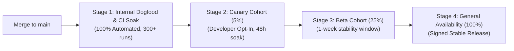

# Condense Release Channels and Canary Deployment Model

This document specifies the release channel taxonomy, canary rollout cohorts, and automated promotion gates for **Condense**.

---

## Release Channels

Condense provides three distinct distribution tracks to balance cutting-edge capability with mission-critical stability:

| Channel | Target Audience | Promotion Cadence | Stability SLA | Failure Telemetry |
| :--- | :--- | :--- | :--- | :--- |
| **Canary** | Automated testbeds, dogfooding engineers, CI soak suites | Built on every merge to `main` | Experimental: regression detection within hours | Opt-in local failure exports with verbose diagnostics |
| **Beta** | Early-adopter developers, preview environments | Weekly release candidate | High: 99.9% reliability across supported ecosystems | Standard opt-in telemetry |
| **Stable** | Production development environments, enterprise teams | Pinned semantic releases (`1.0.x`) | Maximum: zero-regression guarantee, verified backward compatibility | Default-disabled |

---

## Canary Cohort Rollout Architecture

Canary releases undergo progressive cohort expansion before promotion to general availability:

### 1. Stage 1: Continuous Integration Soak (0% Public)
- Triggered automatically on GitHub Actions matrix across Ubuntu Linux (x64, arm64), macOS (Apple Silicon, Intel), and Windows x64.
- Runs 300 iterations of native execution soak (`NativeSoakIT`, `NativeReliabilityIT`).
- Gate: Zero process crashes, zero child exit code mutations, zero orphaned process trees.

### 2. Stage 2: Canary Cohort (5% Opt-in)
- Distributed via `condense update --channel canary`.
- 48-hour soak testing real-world command workloads across diverse toolchains.
- Gate:
  - Error rate under 0.01% of proxied invocations.
  - Zero reports of corrupted stdout or lost stderr.
  - Zero SQLite database lock storms or corruption incidents.

### 3. Stage 3: Beta Cohort (25% Opt-in)
- Distributed via `condense update --channel beta`.
- 7-day observation period across active developer environments.
- Gate:
  - Complete drift test validation (`CommandInventoryDriftTest`, `DocumentationDriftTest`).
  - Validated clean upgrade and rollback drills (`DatabaseRollbackDrillTest`).

### 4. Stage 4: Stable Promotion (100%)
- Signed SLSA provenance build tagged with semantic version (e.g. `v1.0.1`).
- Published to official distribution channels (Homebrew, Scoop, GitHub Releases, standalone installers).

---

## Health Metrics and Automated Rollback Triggers

An automated rollback or deployment halt is immediately triggered if any of the following conditions are detected during canary or beta observation:

1. **Child Exit Code Mutation**: Any instance where `condense <cmd>` exits with a status code different from `<cmd>` (Sev-1).
2. **Standard Error Truncation**: Dropped stderr bytes during failure processing.
3. **Database Migration Lockup**: Unhandled SQLite exception during `SchemaMigrator.migrate()`.
4. **Memory / Latency Degradation**: Native binary startup exceeding 50ms or heap usage exceeding 50 MB RSS.
